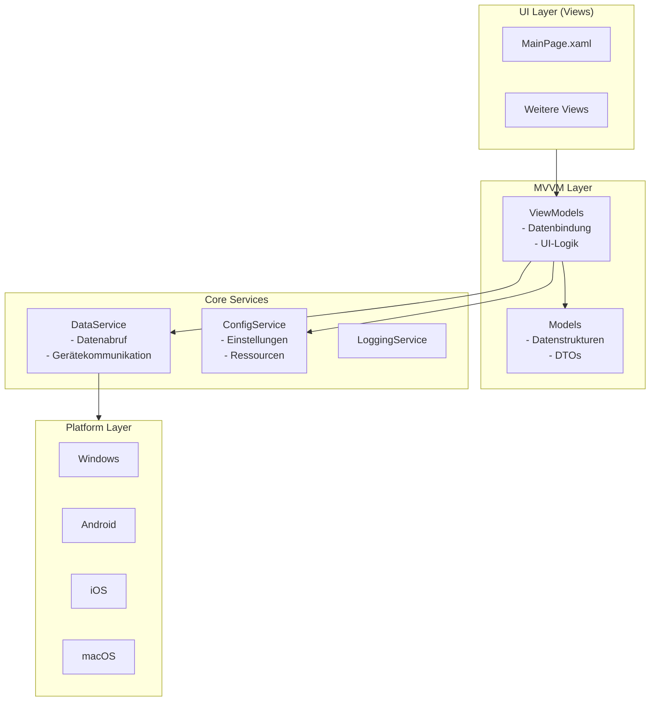

# IndustrialLink

IndustrialLink ist eine .NET MAUI‑Anwendung, die als zentrale Oberfläche zur Visualisierung, Steuerung und Verwaltung industrieller Datenquellen dient.  
Das Projekt ist als Cross‑Platform‑App ausgelegt und kann auf Windows, macOS, Android und iOS ausgeführt werden.

## 🚀 Ziel der Anwendung

IndustrialLink soll eine moderne, leichtgewichtige und erweiterbare Benutzeroberfläche bereitstellen, um:

- industrielle Geräte oder Datenpunkte anzubinden,
- deren Status und Werte in Echtzeit anzuzeigen,
- einfache Interaktionen oder Steuerbefehle auszuführen,
- Visualisierungen über Views bereitzustellen,
- Konfigurationen über Properties und Resources zu verwalten.

Die Architektur ist modular aufgebaut, sodass zukünftige Erweiterungen (z. B. neue Datenquellen, Visualisierungsarten oder Kommunikationsprotokolle) einfach ergänzt werden können.

---

## 🧱 Projektstruktur

| Ordner / Datei | Beschreibung |
|----------------|--------------|
| **Platforms/** | Plattform­spezifische Implementierungen für Android, iOS, macOS und Windows. |
| **Properties/** | Projekt‑ und Assembly‑Konfigurationen. |
| **Resources/** | Statische Ressourcen wie Bilder, Styles, Schriftarten und App‑Assets. |
| **Views/** | UI‑Seiten der Anwendung (XAML‑basiert). |
| **App.xaml / App.xaml.cs** | Globale App‑Ressourcen und Einstiegspunkt der UI‑Initialisierung. |
| **AppShell.xaml / AppShell.xaml.cs** | Shell‑Navigation und grundlegende Seitenstruktur. |
| **MauiProgram.cs** | Konfiguration der MAUI‑App, Dependency Injection, Services. |
| **IndustrialLink.csproj** | Projektdatei mit Build‑Konfigurationen. |
| **IndustrialLink.sln** | Visual‑Studio‑Solution. |

---

## 🏗️ Architekturübersicht

Die Anwendung folgt einer klaren, erweiterbaren Struktur basierend auf .NET MAUI und MVVM‑Prinzipien.

### 📐 Architekturdiagramm

Dieses Diagramm zeigt:
- **UI Layer:** XAML-Views, die über Data Binding mit ViewModels verbunden sind
- **MVVM Layer:** Trennung von UI-Logik und Daten
- **Core Services:** zentrale Logik, unabhängig von der Platform
- **Platform Layer:** MAUI-spezifische Implementierungen für jede Zielplattform

---

## 🖥️ Funktionsweise
Die Anwendung basiert auf dem .NET MAUI‑Framework und nutzt:
- **XAML** für die UI‑Definition
- **MVVM‑Strukturen** (vorbereitet, aber noch nicht vollständig implementiert)
- **Shell‑Navigation** für eine moderne App‑Navigation
- **Ressourcen‑ und Stylesystem** für ein konsistentes UI‑Design

Aktuell enthält das Projekt die Grundstruktur einer MAUI‑App, die als Basis für weitere industrielle Funktionen dient.
Die Views können später erweitert werden, um:
- Live‑Daten anzuzeigen
- Maschinenzustände zu visualisieren
- Dashboards zu erstellen
- Steuerbefehle zu senden
- Logging‑ oder Monitoring‑Funktionen einzubauen

---

## 🛣️ Roadmap

### Phase 1 – Basisfunktionalität (aktuell)
- [x] Grundgerüst der MAUI‑App
- [x] Shell‑Navigation
- [x] Erste Views
- [x] Ressourcen‑ und Style‑System
- [x] Projektstruktur für MVVM vorbereitet

### Phase 2 – Datenanbindung
- [ ] Implementierung eines DataService
- [ ] Unterstützung für erste industrielle Protokolle (z. B. OPC UA, MQTT, Modbus)
- [ ] Simulationsmodus für Testdaten

### Phase 3 – Visualisierung
- [ ] Live‑Charts für Messwerte
- [ ] Statusanzeigen (Ampeln, Icons, Maschinenzustände)
- [ ] Dashboard‑System

### Phase 4 – Interaktion & Steuerung
- [ ] Senden von Befehlen an Geräte
- [ ] Benutzerrechte / Rollen
- [ ] Logging und Audit‑Trail

### Phase 5 – Erweiterbarkeit
- [ ] Plugin‑System für neue Datenquellen
- [ ] Theme‑System (Dark/Light Mode)
- [ ] Export‑/Import‑Funktionen für Konfigurationen

### Phase 6 – Deployment
- [ ] Windows‑Installer
- [ ] Android‑/iOS‑Builds
- [ ] Auto‑Update‑Mechanismus

---

## 🛠️ Voraussetzungen
- .NET 8 SDK oder neuer
- Visual Studio 2022 mit MAUI‑Workload
- Für mobile Builds: Android/iOS‑Buildtools entsprechend der MAUI‑Dokumentation

---

## ▶️ Starten der Anwendung
1. Repository klonen
2. In Visual Studio öffnen
3. Zielplattform auswählen (Windows, Android, etc.)
4. Projekt starten

---

## 📄 Lizenz
Dieses Projekt steht unter der MIT‑Lizenz.  
Details siehe [`LICENSE`](LICENSE).

---

## 📌 Status
Das Projekt befindet sich in einer frühen Phase und dient aktuell als Grundgerüst für eine industrielle Visualisierungs‑ und Steuerungsanwendung.  
Weitere Funktionen werden schrittweise ergänzt.

--- 

## 🤝 Beiträge
Pull Requests, Ideen und Erweiterungen sind willkommen!  
Bitte Issues nutzen, um Fehler zu melden oder neue Features vorzuschlagen.